# overviewpy 


 [](http://github.com/badges/stability-badges)
 

overviewpy aims to make it easy to get an overview of a data set by displaying relevant sample information. 

## Installation

```bash
$ pip install overviewpy
```

## Usage

### Implemented Functions
The goal of `overviewpy` is to make it easy to get an overview of a data set by displaying relevant sample information. At the moment, there are the following functions:

- `overview_tab` generates a tabular overview of the sample (and returns a data frame). The general sample plots a two-column table that provides information on an id in the left column and a the time frame on the right column.
- `overview_markdown` converts the output of `overview_tab` into a Markdown table that can be copy-pasted into any Markdown document or saved as a `.md` file.
- `overview_na` plots an overview of missing values by variable (both by row and by column)
- `overview_summary` returns a per-column summary of any data frame (non-null count, unique count, sample values)
- `overview_plot` visualizes observation presence across id and time as a connected dot-plot
- `overview_overlap` plots comparison plots (bar chart or Venn diagram) to compare the ID coverage of two data frames
- `overview_heat` plots a heat map of observation counts (or percentages) for each id-time combination
- `overview_crossplot` plots a scatter of two conditions split by their thresholds, dividing observations into four quadrants
- `overview_crosstab` sorts observations into a 2×2 cross table based on two conditions and their thresholds
- `overview_latex` converts the output of `overview_tab` or `overview_crosstab` into a LaTeX table, which can be printed or saved directly as a `.tex` file.

#### `overview_tab`

Generate some general overview of the data set using the time and scope
conditions with `overview_tab`. The resulting data frame collapses the time condition for each `id` by
taking into account potential gaps in the time frame.

Rows with missing values in either the `id` or `time` column are automatically
dropped and a `UserWarning` is raised for each affected variable.

```python
from overviewpy.overviewpy import Overview
import pandas as pd

data = {
       'id': ['RWA', 'RWA', 'RWA', 'GAB', 'GAB', 'FRA', \
        'FRA', 'BEL', 'BEL', 'ARG'],
       'year': [2022, 2023, 2021, 2023, 2020, 2019, 2015, \
        2014, 2013, 2002]
   }

df = pd.DataFrame(data)

overview = Overview(df=df, id='id', time='year')
df_overview = overview.overview_tab()
```

The output is a data frame with one row per id and a `time_frame` column that compresses consecutive years into ranges (e.g. `2021-2023`) and non-consecutive years as a comma-separated list (e.g. `2015, 2019`):

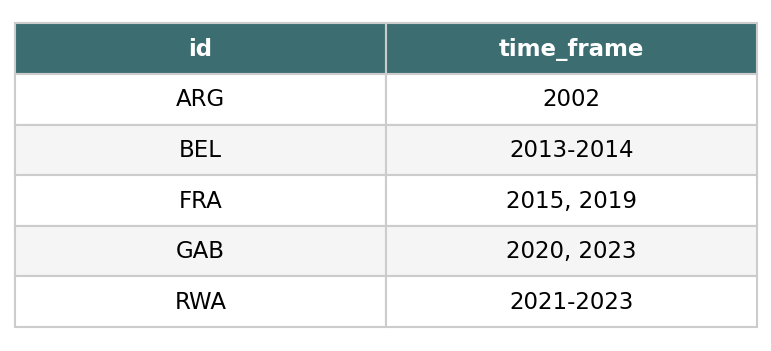

If your data contains missing values in `id` or `year`, they are silently
removed and you will see a warning — no extra preprocessing needed:

```python
import numpy as np

data_with_na = {
    'id': ['RWA', 'RWA', np.nan, 'GAB'],
    'year': [2022, np.nan, 2021, 2020],
}

df_na = pd.DataFrame(data_with_na)

# UserWarning: missing id and time values are dropped automatically
overview = Overview(df=df_na, id='id', time='year')
df_overview = overview.overview_tab()
```

#### `overview_markdown`

`overview_markdown` converts the output of `overview_tab` into a Markdown table. The result can be printed, copy-pasted into any Markdown document, or saved directly as a `.md` file.

```python
from overviewpy.overviewpy import Overview
import pandas as pd

data = {
       'id': ['RWA', 'RWA', 'RWA', 'GAB', 'GAB', 'FRA', \
        'FRA', 'BEL', 'BEL', 'ARG'],
       'year': [2022, 2023, 2021, 2023, 2020, 2019, 2015, \
        2014, 2013, 2002]
   }

df = pd.DataFrame(data)

overview = Overview(df=df, id='id', time='year')
print(overview.overview_markdown())
```

This produces:

```markdown
## Time and scope of the sample

| Sample | Time frame |
|---|---|
| ARG | 2002 |
| BEL | 2013-2014 |
| FRA | 2015, 2019 |
| GAB | 2020, 2023 |
| RWA | 2021-2023 |
```

You can customise the title and column headers, and optionally save to a file:

```python
overview.overview_markdown(
    title="My sample",
    id="Country",
    time="Years covered",
    file_path="output/sample_overview.md",
)
```

#### `overview_na`

`overview_na` visualises missing values in your data. It returns a
horizontal bar plot showing the amount of missing data (NAs) for each variable,
sorted from most to least missing. By default it shows percentages (`perc=True`);
pass `perc=False` to display absolute counts instead. Switch to `row_wise=True`
for a per-observation view, or set `add=True` to append the NA statistics
directly to your data frame.

```python
from overviewpy.overviewpy import Overview
import pandas as pd
import numpy as np

data_na = {
        'id': ['RWA', 'RWA', 'RWA', np.nan, 'GAB', 'GAB',\
            'FRA', 'FRA', 'BEL', 'BEL', 'ARG', np.nan,  np.nan],
        'year': [2022, 2001, 2000, 2023, 2021, 2023, 2020, \
            2019,  np.nan, 2015, 2014, 2013, 2002]
    }

df_na = pd.DataFrame(data_na)

ov_na = Overview(df=df_na, id='id', time='year')

# Default: column-wise, percentage
ov_na.overview_na()

# Absolute counts instead of percentage
ov_na.overview_na(perc=False)

# Custom y-axis label
ov_na.overview_na(yaxis="My Variables")

# Row-wise: one bar per observation
ov_na.overview_na(row_wise=True)

# Row-wise and augment the data frame with na_count and percentage columns
df_with_na = ov_na.overview_na(row_wise=True, add=True)
```

Column-wise output (default):

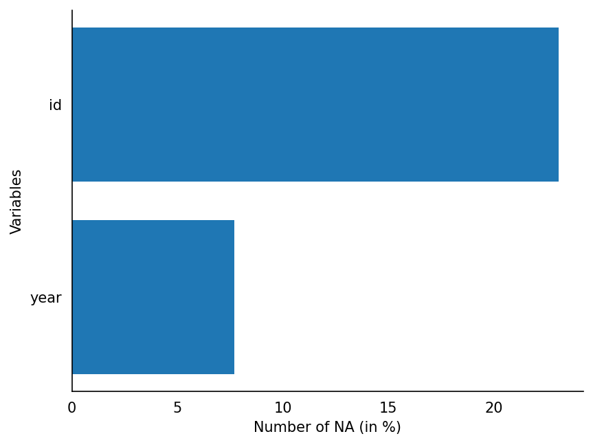

Row-wise output:

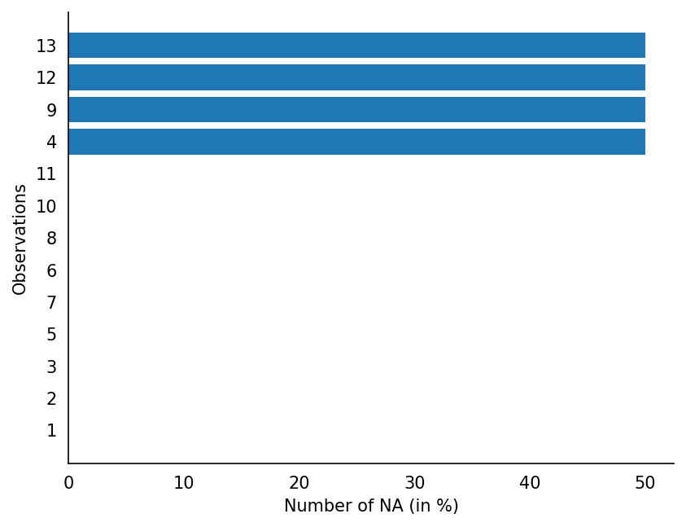

#### `overview_summary`

Use `overview_summary` to get a quick structured overview of any data frame:

```python
from overviewpy.overviewpy import Overview
import pandas as pd

df = pd.read_csv("mydata.csv")
overview = Overview(df=df, id=None, time=None)
overview.overview_summary()
```

This returns a data frame with one row per column containing `non_null_count`, `unique_count`, and `sample_values`:

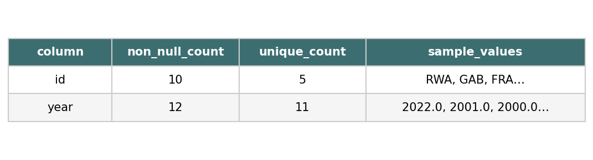

#### `overview_plot`

`overview_plot` visualizes the presence of observations across the id and time
dimensions. Each id appears as a row; time is on the x-axis. Consecutive time
periods are connected by a line; gaps in coverage produce separate disconnected
clusters. Optionally color-code points by a third variable.

```python
from overviewpy.overviewpy import overview_plot
import pandas as pd

data = {
    'id': ['RWA', 'RWA', 'RWA', 'GAB', 'GAB', 'FRA', 'FRA', 'BEL', 'BEL', 'ARG'],
    'year': [2022, 2023, 2021, 2023, 2020, 2019, 2015, 2014, 2013, 2002]
}

df = pd.DataFrame(data)

overview_plot(df, id='id', time='year')
```

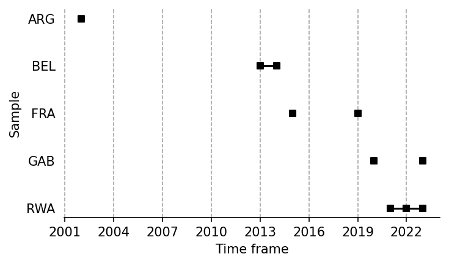

You can color-code the points by a third variable using the `color` parameter:

```python
# color-code points by a third variable
overview_plot(df, id='id', time='year', color='regime')
```

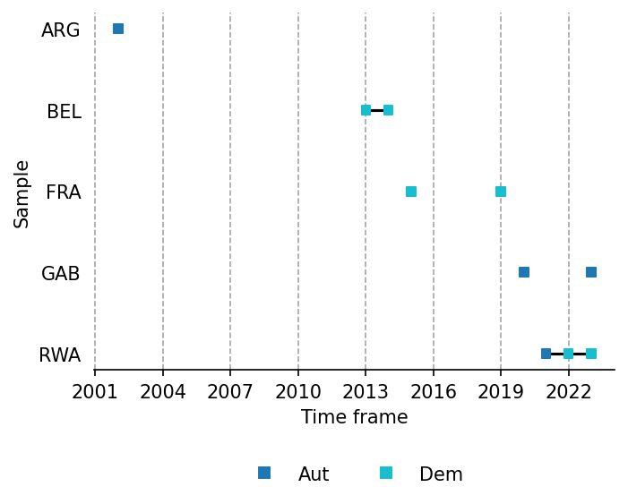

#### `overview_overlap`

`overview_overlap` compares two data frames by visualizing how much their ID columns overlap. Use `plot_type="bar"` (default) for a grouped bar chart showing observation counts per identifier, or `plot_type="venn"` for a two-set Venn diagram.

```python
from overviewpy.overviewpy import Overview
import pandas as pd

data2 = {'id': ['RWA', 'GAB', 'GAB', 'ARG', 'ARG']}
df2 = pd.DataFrame(data2)

# Grouped bar chart (default)
overview = Overview(df=df, id='id', time='year')
overview.overview_overlap(dat2=df2, dat2_id='id', dat1_name='Survey 1', dat2_name='Survey 2')
```

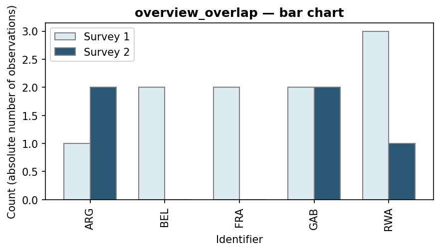

```python
# Venn diagram
overview.overview_overlap(dat2=df2, dat2_id='id', dat1_name='Survey 1', dat2_name='Survey 2', plot_type='venn')
```

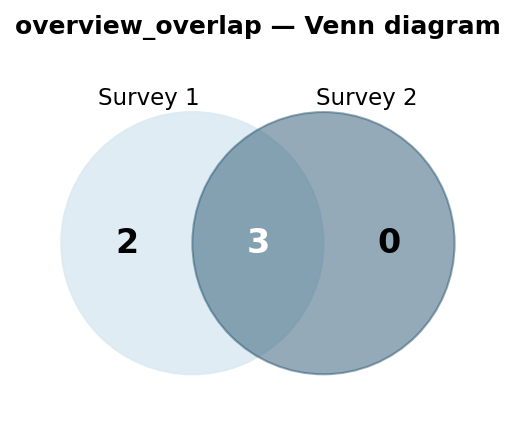

#### `overview_heat`

`overview_heat` plots a heat map that shows how many observations exist for each id-time combination. Set `perc=True` together with `exp_total` to display coverage as a percentage of the expected maximum.

```python
from overviewpy.overviewpy import Overview
import pandas as pd

overview = Overview(df=df, id='id', time='year')
overview.overview_heat()
```


```python
# Percentage view
overview.overview_heat(perc=True, exp_total=3)
```

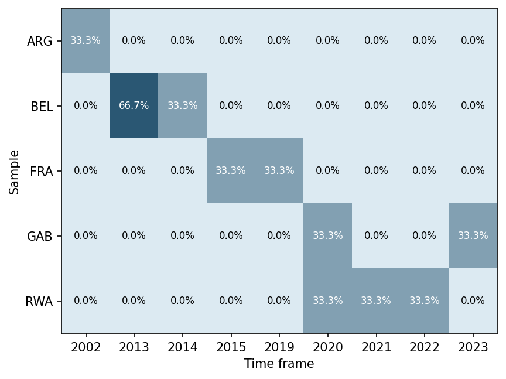

#### `overview_crossplot`

`overview_crossplot` visualises two conditions against user-defined thresholds. Each observation is placed at its mean `cond1`/`cond2` values after aggregating to unique (id, time) pairs. Vertical and horizontal threshold lines divide the plot into four quadrants.

```python
from overviewpy.overviewpy import Overview
import pandas as pd

data = {
    'id': ['RWA', 'RWA', 'GAB', 'GAB', 'FRA'],
    'year': [2020, 2021, 2020, 2021, 2020],
    'gdp': [10000, 30000, 20000, 50000, 26000],
    'population': [12000000, 13000000, 2000000, 2100000, 68000000],
}

df = pd.DataFrame(data)
overview = Overview(df=df, id='id', time='year')

# Basic plot
overview.overview_crossplot(cond1='gdp', cond2='population',
                            threshold1=25000, threshold2=27000000)
```

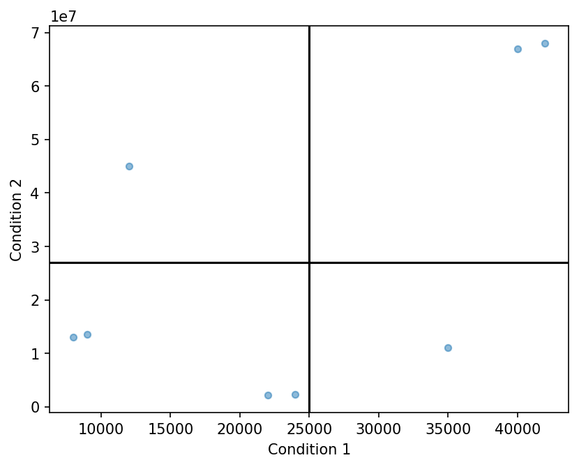

```python
# With quadrant coloring and point labels
overview.overview_crossplot(cond1='gdp', cond2='population',
                            threshold1=25000, threshold2=27000000,
                            color=True, label=True,
                            xaxis="GDP per capita", yaxis="Population")
```

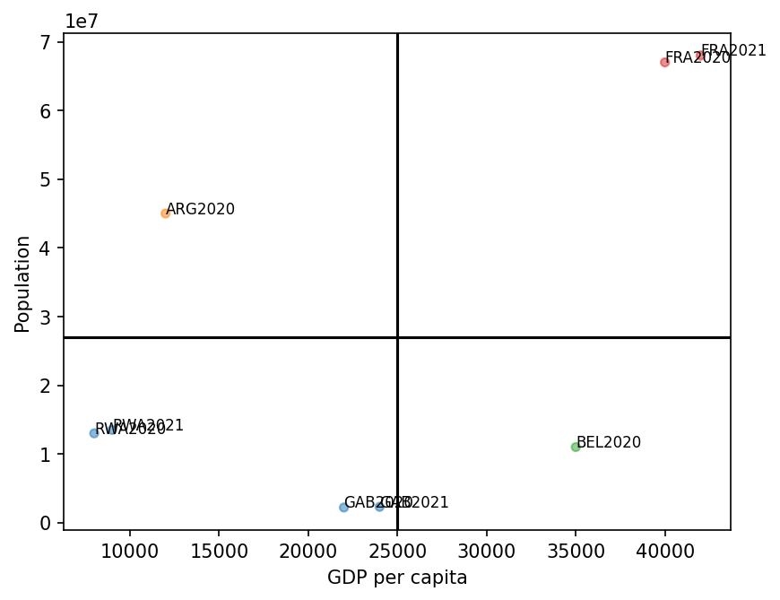

#### `overview_latex`

Use `overview_latex` to export the result of `overview_tab` as a LaTeX table:

```python
from overviewpy.overviewpy import Overview
import pandas as pd

data = {
       'id': ['RWA', 'RWA', 'RWA', 'GAB', 'GAB', 'FRA',
               'FRA', 'BEL', 'BEL', 'ARG'],
       'year': [2022, 2023, 2021, 2023, 2020, 2019, 2015,
                2014, 2013, 2002]
   }

df = pd.DataFrame(data)
ovw = Overview(df=df, id='id', time='year')
df_overview = ovw.overview_tab()

# Print LaTeX to the console
ovw.overview_latex(df_overview, title="Time and scope", id="Country", time="Years")

# Save directly to a .tex file
ovw.overview_latex(df_overview, save_out=True, file_path="output.tex")
```

#### `overview_crosstab`

`overview_crosstab` sorts a dataset into a 2×2 cross table based on two numeric conditions and their thresholds. Each cell lists the id–time entries that fall into that quadrant.

```python
from overviewpy.overviewpy import Overview
import pandas as pd

data = {
    'id':  ['RWA', 'RWA', 'GAB', 'GAB', 'FRA', 'FRA', 'BEL', 'BEL', 'ARG'],
    'year': [2020,  2021,  2020,  2021,  2020,  2021,  2020,  2021,  2020],
    'gdp':  [30000, 32000, 20000, 21000, 35000, 36000, 15000, 15500, 28000],
    'pop':  [13000000, 13500000, 2300000, 2400000, 67000000, 68000000,
             11500000, 11600000, 45000000],
}

df = pd.DataFrame(data)
ovw = Overview(df=df, id='id', time='year')

ovw.overview_crosstab(
    cond1='gdp',
    cond2='pop',
    threshold1=25000,
    threshold2=10000000,
)
```

The result is a 2×2 `DataFrame` whose rows and columns are labelled by the threshold conditions:

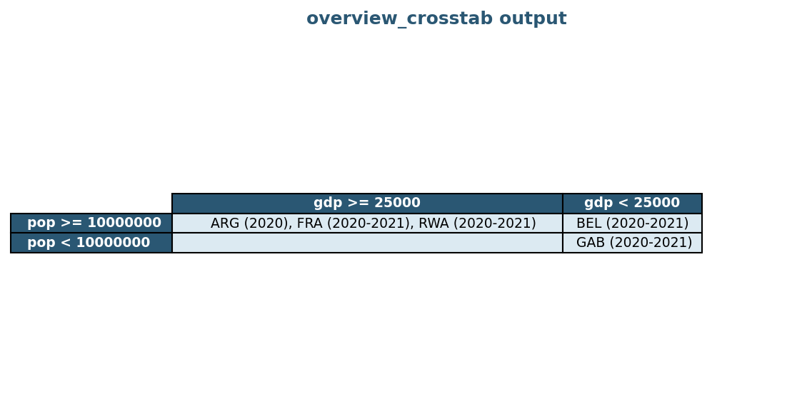

If duplicate `(id, time)` pairs exist, the conditions are averaged before thresholding. Missing values in `id` are dropped automatically.

##### Command line

Alternatively, run the summarizer from the command line to generate an HTML report:

##### Invocation
```
usage: $ python -m overviewpy [-h] [-d DELIMITER] [-t {csv}] [-o {file,stdout}] datafile

positional arguments:
  datafile              The data file to read. Expects a path to a readable data file.

options:
  -h, --help            show this help message and exit
  -d DELIMITER, --delimiter DELIMITER
                        Define the character(s) which delimit the file. Defaults to ','.
  -t {csv,excel,fwf}, --filetype {csv,excel,fwf}
                        File type to parse the datafile with. Inferred from the file extension if omitted.
  -o {file,stdout}, --output-type {file,stdout}
                        Type of output desired. Defaults to creating an HTML file.
```

##### Output

The default output is created as an HTML file in the same directory as the datafile passed in. The output file will be
named with the stem of the datafile name and `-summary.html`. For example, if your datafile is named `magicdata.csv`,
the output file would be `magicdata-summary.html`

The output file will list, at the top, some summary information about the number of rows and columns in the file.

Below that frontmatter is a table listing, for each included column in the file:

1. The column name
2. The number of non-null/empty values for that column
3. The number of unique non-null values for that column
4. A set of 5 example values found in that column.

## Contributing

Interested in contributing? Check out the [contributing guidelines](/CONTRIBUTING.md). Please note that this project is released with a [Code of Conduct](/CONDUCT.md). By contributing to this project, you agree to abide by its terms.

## License

`overviewpy` is licensed under the terms of the BSD 3-Clause license.

## Credits

`overviewpy` was created with [`cookiecutter`](https://cookiecutter.readthedocs.io/en/latest/) and the `py-pkgs-cookiecutter` [template](https://github.com/py-pkgs/py-pkgs-cookiecutter).
